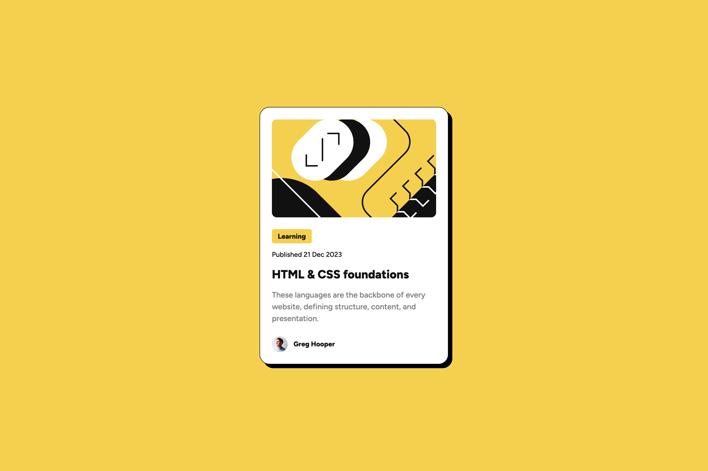

# Blog preview card

This is a solution to the [blog preview card challenge on Frontend Mentor](https://www.frontendmentor.io/challenges/blog-preview-card-ckPaj01IcS). Frontend Mentor challenges help you improve your coding skills by building realistic projects.

## Table of contents

- [The challenge](#the-challenge)
- [Screenshot](#screenshot)
- [Links](#links)
- [Built with](#built-with)
- [Author](#author)

## The challenge

Users should be able to:

- See hover and focus states for all interactive elements on the page

## Screenshot

## Links

- [Solution URL](https://github.com/annaindistress/frontend-mentor-blog-preview-card)
- [Live Site URL](https://annaindistress.github.io/frontend-mentor-blog-preview-card/)

## Built with

- Semantic HTML5 markup
- Mobile-first workflow
- CSS custom properties
- PostCSS
- Vite

## Author

- Frontend Mentor - [@annaindistress](https://www.frontendmentor.io/profile/annaindistress)
